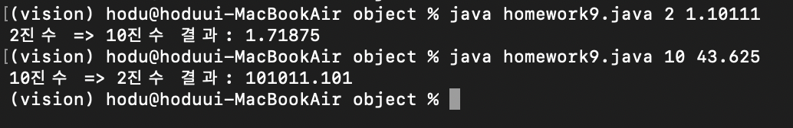
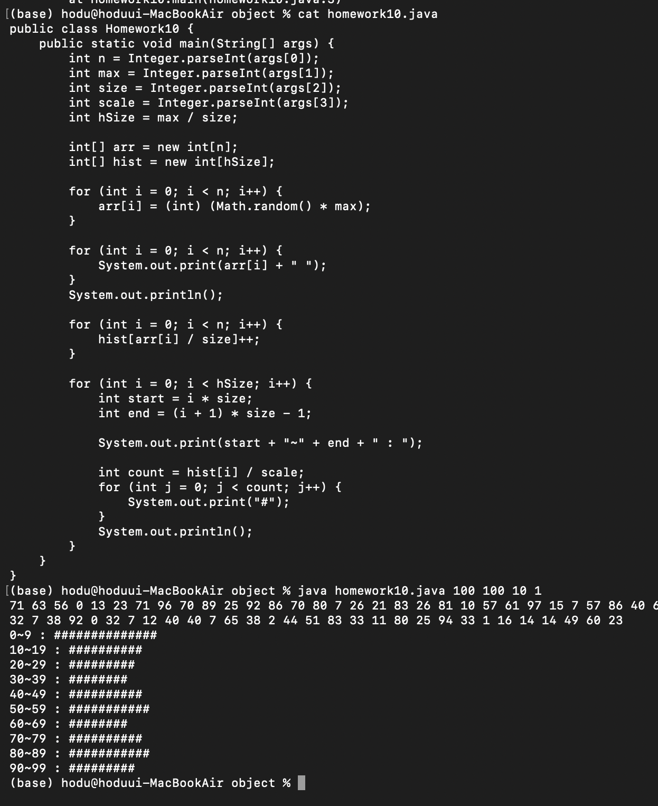
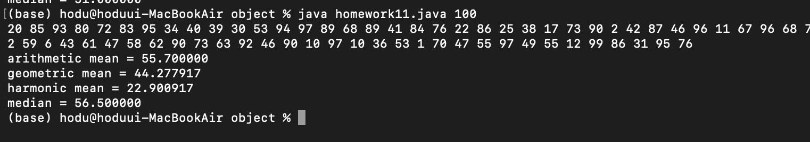
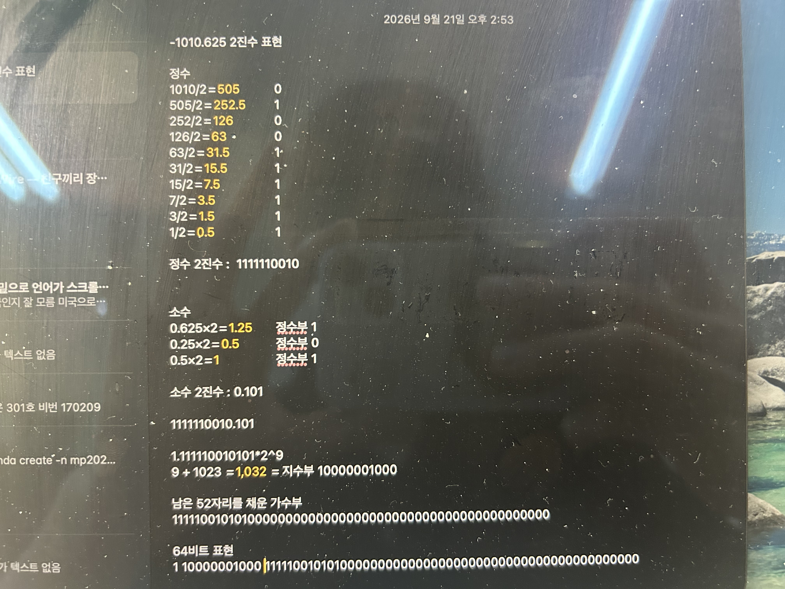
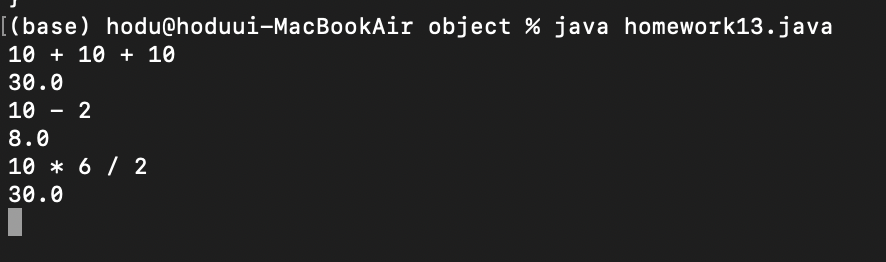

# OOP2026
### Homework1
```java
public class Homework1 {
    public static void main(String[] args) {
        int i, j;
        for(i=0; i<10; i++){
            for(j=0; j<=i; j++){
                System.out.print(" ");
            }
            for(; j<=10; j++){
                System.out.print("#");
            }
            System.out.println();
        }

        for(i=0; i<10; i++){
            for(j=0; j<=i; j++){
                System.out.print("#");
            }
            for(; j<=10; j++){
                System.out.print(" ");
            }
            System.out.println();
        }

        for(i=10; i>0; i--){
            for(j=0; j<i; j++){
                System.out.print("#");
            }
            for(; j<=10; j++){
                System.out.print(" ");
            }
            System.out.println();
        }

        for(i=10; i>0; i--){
            for(j=0; j<=i; j++){
                System.out.print(" ");
            }
            for(; j<=10; j++){
                System.out.print("#");
            }
            System.out.println();
        }
    }
}
```


### Homework2
```java
public class Homework2 {
    public static void main(String[] args) {
        int n = 20;
        int first = 1;
        int second = 1;

        System.out.print(first + " " + second + " ");

        for (int i = 3; i <= n; i++) {
            int next = first + second;
            System.out.print(next + " ");
            
            first = second;
            second = next;
        }
    }
}
```


### Homework3
```java
public class Homework3 {
    public static void main(String[] args) {
        double a = 1;
        double b = 2;

        for (int i = 1; i <= 20; i++) {
            double ratio = b / a;
            
            if (ratio == (int) ratio) {
                System.out.printf("%d/%.0f=%.1f\n", (int)b, a, ratio);
            } else {
                String ratioStr = String.format("%.3f", ratio).replaceAll("0+$", "");
                if (ratioStr.endsWith(".")) {
                    ratioStr += "0";
                }
                System.out.printf("%d/%.0f=%s\n", (int)b, a, ratioStr);
            }

            double next = a + b;
            a = b;
            b = next;
        }
    }
}

```


### Homework4
```java
public class MultiplicationTable {
    public static void main(String[] args) {
        for (int i = 1; i <= 9; i++) {
            for (int j = 1; j <= 9; j++) {
                System.out.printf("%d*%d=%d\t", j, i, j * i);
            }
            System.out.println();
        }
    }
}
```


### Homework5
```java
public class Homework5 {
    public static void main(String[] args) {
        GregoryLeibniz();
        Madhava();
    }

    public static void GregoryLeibniz(){
        double pi = 0.0;
        double sign = 1.0;
        int iterations = 1000;

        for (int i = 0; i < iterations; i++) {
            double denominator = 2 * i + 1;
            pi += sign * (4.0 / denominator);
            sign = -sign;
        }

        System.out.println("원주율: " + pi);
    }

    public static void Madhava(){
        double sum = 0.0;
        int iterations = 30;

        for (int k = 0; k < iterations; k++) {
            double term = Math.pow(-3, -k) / (2 * k + 1);
            sum += term;
        }

        double pi = Math.sqrt(12) * sum;

        System.out.println("원주율: " + pi);
    }
}
```


### Homework6
```java
public class Homework6 {
    public static void main(String[] args) {
        int[][] binomial = new int[10][];

        for (int i = 0; i < 10; i++) {
            binomial[i] = new int[i + 1];
            binomial[i][0] = 1;
            binomial[i][i] = 1;
            for (int j = 1; j < i; j++) {
                binomial[i][j] = binomial[i - 1][j - 1] + binomial[i - 1][j];
            }
        }

        for (int i = 0; i < 10; i++) {
            for (int j = 0; j <= i; j++) {
                System.out.print(binomial[i][j] + " ");
            }
            System.out.println();
        }
    }
}
```


### Homework7
```java
public class Homework7 {
    public static void main(String[] args) {
        int data[] = new int[20];
        for(int i=0; i<20; i++){
            data[i]=(int)(Math.random()*100);
        }

        for(int i=0; i<20; i++){
            System.out.print(data[i] + " ");
        }
        System.out.println();

        for (int i = 0; i < data.length - 1; i++) {
            int minIndex = i;

            for (int j = i + 1; j < data.length; j++) {
                if (data[j] < data[minIndex]) {
                    minIndex = j;
                }
            }

            int temp = data[i];
            data[i] = data[minIndex];
            data[minIndex] = temp;
        }

        for (int i = 0; i < 20; i++) {
            System.out.print(data[i] + " ");
        }
        System.out.println();
    }
}
```


### Homework8
```java
public class Homework8 {
    public static void main(String[] args) {
        int students = 30;
        int subjects = 4;
        int[][] score = new int[students][subjects];

        for (int i = 0; i < students; i++) {
            int sum = 0;
            for (int j = 0; j < subjects; j++) {
                score[i][j] = (int) (Math.random() * 101);
                sum += score[i][j];
            }
            System.out.printf("%d\t%d\t%d\t%d\t%d\n", score[i][0], score[i][1], score[i][2], score[i][3], sum);
        }
    }
}
```


### Homework9
```java
public class Homework9 {
	// 10 to 2
	public static String ToBinary(int data) {
		String result = "";

		if (data == 0) {
			result = "0";
		} else {
			while (data > 0) {
				int remainder = data % 2;
				result = remainder + result;
				data /= 2;
			}
		}

		return result;
	}

	// 2 to 10
	public static int ToDecimal(String data) {
		int result = 0;
		for (int i = 0; i < data.length(); i++) {
			int bit = data.charAt(data.length() - 1 - i) - '0';
			result += bit * Math.pow(2, i);
		}
		return result;
	}

	public static void main(String[] args) {
		if (args[0].equals("2")) {
			// 2진법 -> 10진법
			if (args[1].contains(".")) {
				// 소수
				String[] parts = args[1].split("\\.");

				double result = 0.0;
				double weight = 0.5;

				for (int i = 0; i < parts[1].length(); i++) {
					int bit = parts[1].charAt(i) - '0';
					
					if (bit == 1) {
						result += weight;
					}
					
					weight /= 2;
				}

				double finalResult = ToDecimal(parts[0]) + result;

				System.out.println("2진수 => 10진수 결과: " + finalResult);
			} else {
				// 정수
				System.out.println("2진수 => 10진수 결과: " + ToDecimal(args[1]));
			}

		} else {
			// 10진법 => 2진법
			if (args[1].contains(".")) {
				// 소수
				String resultAfter = "";
				String[] parts = args[1].split("\\.");
				int precision = 10;
				int dataBefore = Integer.parseInt(parts[0]);
				double dataAfter = Double.parseDouble("0." + parts[1]);

				while (dataAfter > 0 && precision > 0) {
					dataAfter *= 2;
					int bit = (int) dataAfter;
					resultAfter += bit;
					dataAfter -= bit;
					precision--;
				}
	
				System.out.println("10진수 => 2진수 결과: " + ToBinary(Integer.parseInt(parts[0])) + "." + resultAfter);
			} else {
				// 정수
				System.out.println("10진수 => 2진수 결과: " + ToBinary(Integer.parseInt(args[1])));
			}
		}
	}
}
```



### Homework10
```java
public class Homework10 {
    public static void main(String[] args) {
        int n = Integer.parseInt(args[0]);
        int max = Integer.parseInt(args[1]);
        int size = Integer.parseInt(args[2]);
        int scale = Integer.parseInt(args[3]);
        int hSize = max / size;
        
        int[] arr = new int[n];
        int[] hist = new int[hSize];
        
        for (int i = 0; i < n; i++) {
            arr[i] = (int) (Math.random() * max);
        }
        
        for (int i = 0; i < n; i++) {
            System.out.print(arr[i] + " ");  
        }
        System.out.println();  
        
        for (int i = 0; i < n; i++) {
            hist[arr[i] / size]++;
        }
        
        for (int i = 0; i < hSize; i++) {
            int start = i * size;
            int end = (i + 1) * size - 1;
            
            System.out.print(start + "~" + end + " : ");
            
            int count = hist[i] / scale;
            for (int j = 0; j < count; j++) {
                System.out.print("#");
            }
            System.out.println();
        }
    }
}

```



### Homework10
```java
public class Homework11 {
    public static void main(String[] args) {
        int array_count;
        if (args.length != 1)
            return;
        array_count = Integer.parseInt(args[0]);
        
        int[] arr = new int[array_count];
        for (int i = 0; i < array_count; i++) {
            arr[i] = (int) (Math.random() * 99) + 1;
        }
        
        for (int i = 0; i < array_count; i++) {
            System.out.print(arr[i] + " ");
        }
        System.out.println();
        
        double sum = 0;
        for (int i = 0; i < array_count; i++) {
            sum += arr[i];
        }
        System.out.printf("arithmetic mean = %f\n", sum / array_count);
        
        double prod = 1;
        for (int i = 0; i < array_count; i++) {
            prod *= arr[i];
        }
        System.out.printf("geometric mean = %f\n", Math.pow(prod, 1.0 / array_count));
        
        double recSum = 0;
        for (int i = 0; i < array_count; i++) {
            recSum += 1.0 / arr[i];
        }
        System.out.printf("harmonic mean = %f\n", array_count / recSum);
        
        for (int i = 0; i < array_count - 1; i++) {
            for (int j = 0; j < array_count - 1 - i; j++) {
                if (arr[j] > arr[j + 1]) {
                    int temp = arr[j];
                    arr[j] = arr[j + 1];
                    arr[j + 1] = temp;
                }
            }
        }
        
        double median = 0;
        if (array_count % 2 == 0) {
            median = (arr[array_count / 2 - 1] + arr[array_count / 2]) / 2.0;
        } else {
            median = arr[array_count / 2];
        }
        System.out.printf("median = %f\n", median);
    }
}
```



### Homework12



### Homework13
```java
import java.util.Scanner;

public class Homework13 {
	public static void main(String[] args) {
		while (true) {
			Scanner scanner = new Scanner(System.in);
			String inputString = scanner.nextLine();
			String[] arrOfStr = inputString.split(" ");
			
			double result = 0;
			
			if (arrOfStr.length == 3) {
				double n1 = Double.parseDouble(arrOfStr[0]);
				String op = arrOfStr[1];
				double n2 = Double.parseDouble(arrOfStr[2]);
				
				if (op.equals("+")) {
					result = n1 + n2;
				} else if (op.equals("-")) {
					result = n1 - n2;
				} else if (op.equals("*")) {
					result = n1 * n2;
				} else if (op.equals("/")) {
					result = n1 / n2;
				} else if (op.equals("#")) {
					result = (n1 + n2) / 2;
				}
				
			} else if (arrOfStr.length == 5) {
				double n1 = Double.parseDouble(arrOfStr[0]);
				String op1 = arrOfStr[1];
				double n2 = Double.parseDouble(arrOfStr[2]);
				String op2 = arrOfStr[3];
				double n3 = Double.parseDouble(arrOfStr[4]);
				
				double temp = 0;
				if (op2.equals("*") || op2.equals("/") || op2.equals("#")){
					if (op2.equals("+")) {
						temp = n2 + n3;
					} else if (op2.equals("-")) {
						temp = n2 - n3;
					} else if (op2.equals("*")) {
						temp = n2 * n3;
					} else if (op2.equals("/")) {
						temp = n2 / n3;
					} else if (op2.equals("#")) {
						temp = (n2 + n3) / 2;
					}

					if (op1.equals("+")) {
						result = temp + n1;
					} else if (op1.equals("-")) {
						result = temp - n1;
					} else if (op1.equals("*")) {
						result = temp * n1;
					} else if (op1.equals("/")) {
						result = temp / n1;
					} else if (op1.equals("#")) {
						result = (temp + n1) / 2;
					}
				}else{
					if (op1.equals("+")) {
						temp = n1 + n2;
					} else if (op1.equals("-")) {
						temp = n1 - n2;
					} else if (op1.equals("*")) {
						temp = n1 * n2;
					} else if (op1.equals("/")) {
						temp = n1 / n2;
					} else if (op1.equals("#")) {
						temp = (n1 + n2) / 2;
					}
					
					if (op2.equals("+")) {
						result = temp + n3;
					} else if (op2.equals("-")) {
						result = temp - n3;
					} else if (op2.equals("*")) {
						result = temp * n3;
					} else if (op2.equals("/")) {
						result = temp / n3;
					} else if (op2.equals("#")) {
						result = (temp + n3) / 2;
					}
				}
			}
			
			System.out.println(result);
		}
	}
}
```



