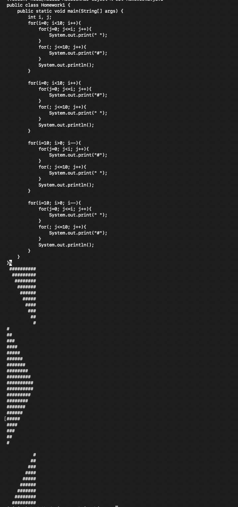
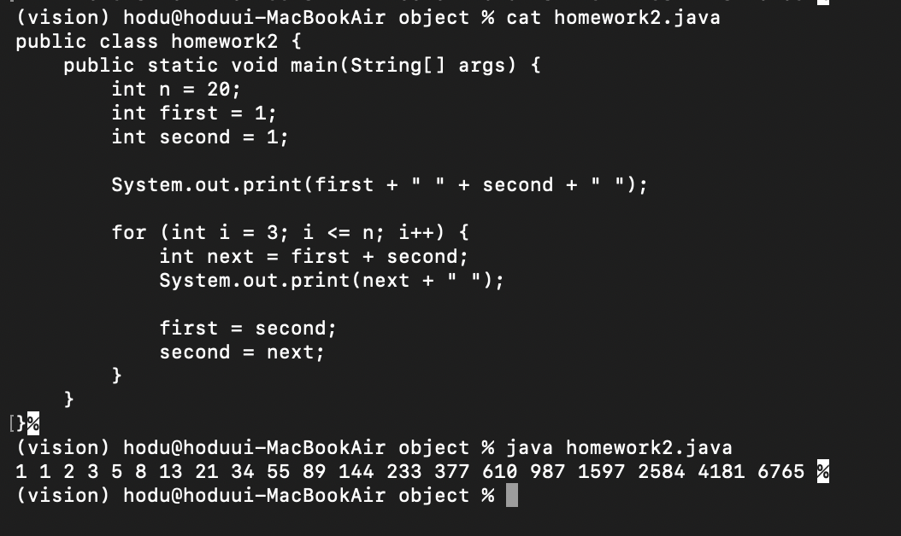
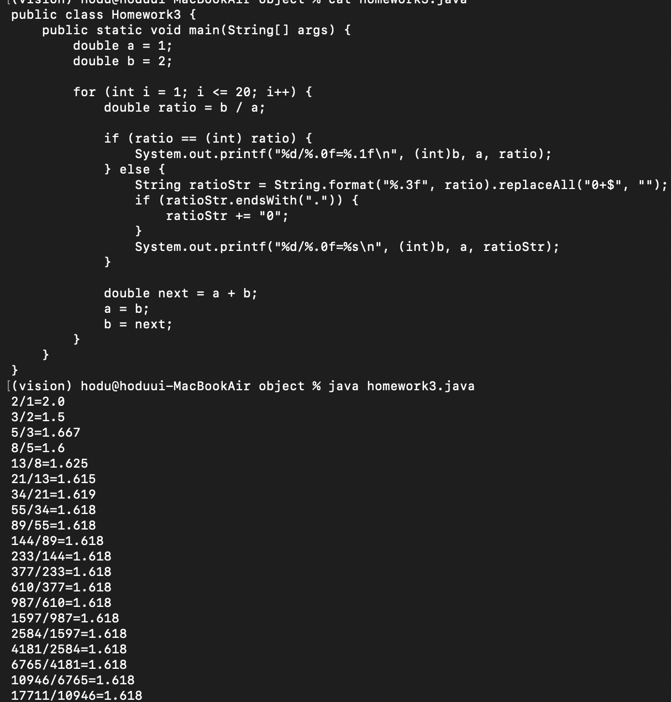
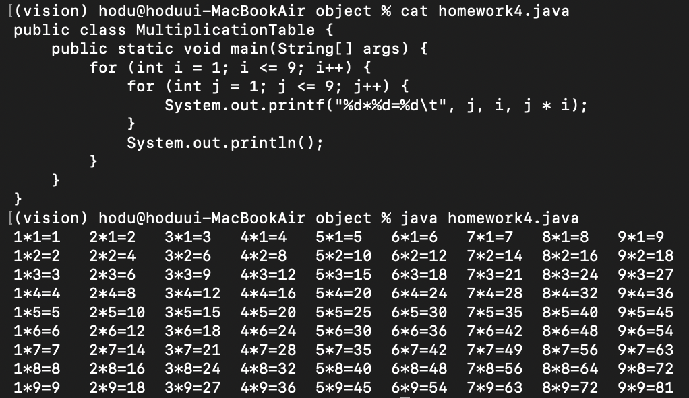
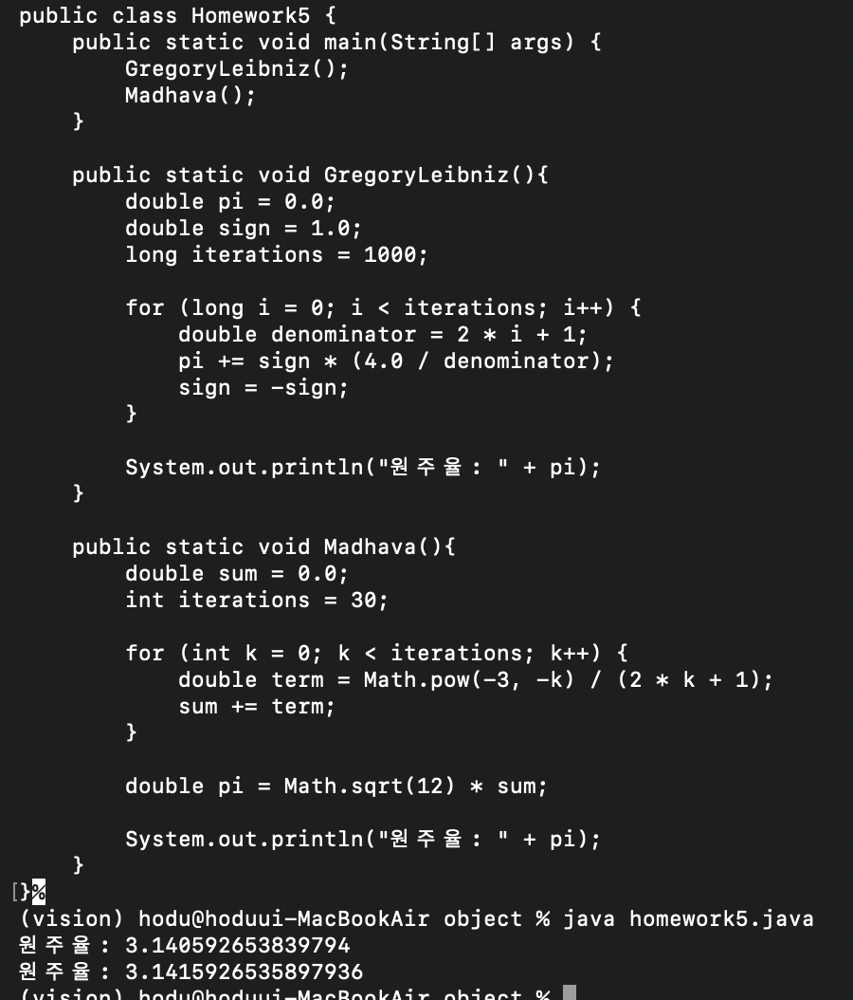
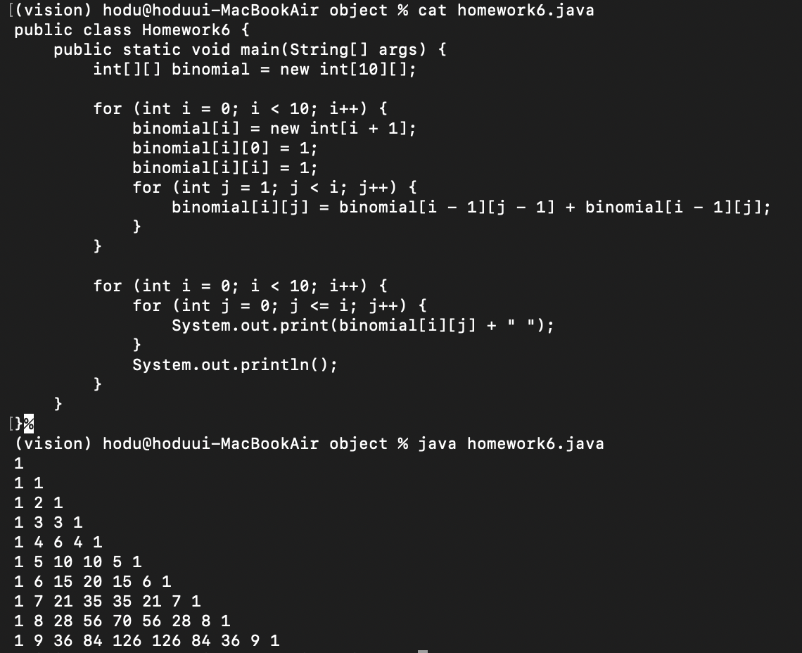
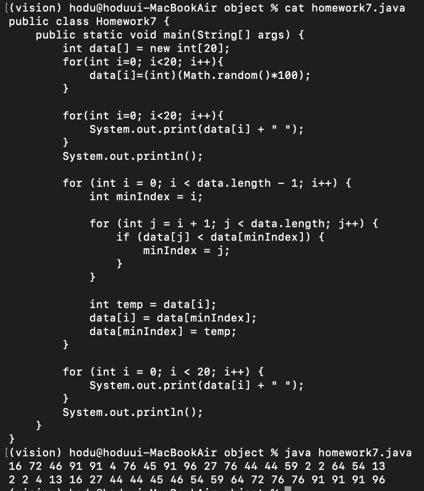
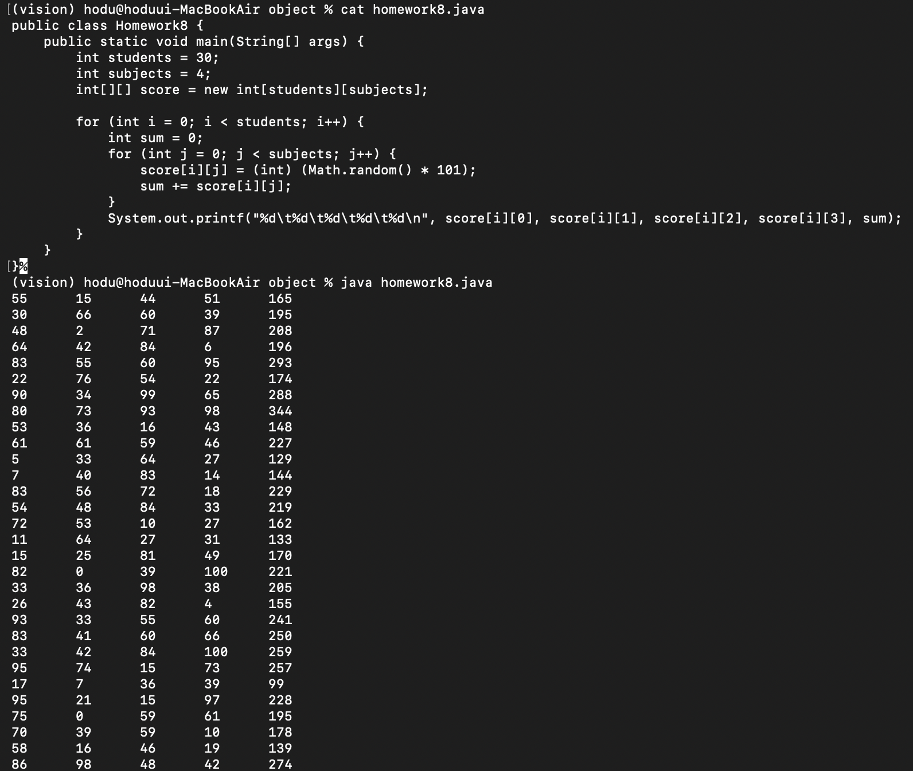

# OOP2026
### Homework1
```java
public class Homework1 {
    public static void main(String[] args) {
        int i, j;
        for(i=0; i<10; i++){
            for(j=0; j<=i; j++){
                System.out.print(" ");
            }
            for(; j<=10; j++){
                System.out.print("#");
            }
            System.out.println();
        }

        for(i=0; i<10; i++){
            for(j=0; j<=i; j++){
                System.out.print("#");
            }
            for(; j<=10; j++){
                System.out.print(" ");
            }
            System.out.println();
        }

        for(i=10; i>0; i--){
            for(j=0; j<i; j++){
                System.out.print("#");
            }
            for(; j<=10; j++){
                System.out.print(" ");
            }
            System.out.println();
        }

        for(i=10; i>0; i--){
            for(j=0; j<=i; j++){
                System.out.print(" ");
            }
            for(; j<=10; j++){
                System.out.print("#");
            }
            System.out.println();
        }
    }
}
```


### Homework2
```java
public class Homework2 {
    public static void main(String[] args) {
        int n = 20;
        int first = 1;
        int second = 1;

        System.out.print(first + " " + second + " ");

        for (int i = 3; i <= n; i++) {
            int next = first + second;
            System.out.print(next + " ");
            
            first = second;
            second = next;
        }
    }
}
```


### Homework3
```java
public class Homework3 {
    public static void main(String[] args) {
        double a = 1;
        double b = 2;

        for (int i = 1; i <= 20; i++) {
            double ratio = b / a;
            
            if (ratio == (int) ratio) {
                System.out.printf("%d/%.0f=%.1f\n", (int)b, a, ratio);
            } else {
                String ratioStr = String.format("%.3f", ratio).replaceAll("0+$", "");
                if (ratioStr.endsWith(".")) {
                    ratioStr += "0";
                }
                System.out.printf("%d/%.0f=%s\n", (int)b, a, ratioStr);
            }

            double next = a + b;
            a = b;
            b = next;
        }
    }
}

```


### Homework4
```java
public class MultiplicationTable {
    public static void main(String[] args) {
        for (int i = 1; i <= 9; i++) {
            for (int j = 1; j <= 9; j++) {
                System.out.printf("%d*%d=%d\t", j, i, j * i);
            }
            System.out.println();
        }
    }
}
```


### Homework5
```java
public class Homework5 {
    public static void main(String[] args) {
        GregoryLeibniz();
        Madhava();
    }

    public static void GregoryLeibniz(){
        double pi = 0.0;
        double sign = 1.0;
        int iterations = 1000;

        for (int i = 0; i < iterations; i++) {
            double denominator = 2 * i + 1;
            pi += sign * (4.0 / denominator);
            sign = -sign;
        }

        System.out.println("원주율: " + pi);
    }

    public static void Madhava(){
        double sum = 0.0;
        int iterations = 30;

        for (int k = 0; k < iterations; k++) {
            double term = Math.pow(-3, -k) / (2 * k + 1);
            sum += term;
        }

        double pi = Math.sqrt(12) * sum;

        System.out.println("원주율: " + pi);
    }
}
```


### Homework6
```java
public class Homework6 {
    public static void main(String[] args) {
        int[][] binomial = new int[10][];

        for (int i = 0; i < 10; i++) {
            binomial[i] = new int[i + 1];
            binomial[i][0] = 1;
            binomial[i][i] = 1;
            for (int j = 1; j < i; j++) {
                binomial[i][j] = binomial[i - 1][j - 1] + binomial[i - 1][j];
            }
        }

        for (int i = 0; i < 10; i++) {
            for (int j = 0; j <= i; j++) {
                System.out.print(binomial[i][j] + " ");
            }
            System.out.println();
        }
    }
}
```


### Homework7
```java
public class Homework7 {
    public static void main(String[] args) {
        int data[] = new int[20];
        for(int i=0; i<20; i++){
            data[i]=(int)(Math.random()*100);
        }

        for(int i=0; i<20; i++){
            System.out.print(data[i] + " ");
        }
        System.out.println();

        for (int i = 0; i < data.length - 1; i++) {
            int minIndex = i;

            for (int j = i + 1; j < data.length; j++) {
                if (data[j] < data[minIndex]) {
                    minIndex = j;
                }
            }

            int temp = data[i];
            data[i] = data[minIndex];
            data[minIndex] = temp;
        }

        for (int i = 0; i < 20; i++) {
            System.out.print(data[i] + " ");
        }
        System.out.println();
    }
}
```


### Homework8
```java
public class Homework8 {
    public static void main(String[] args) {
        int students = 30;
        int subjects = 4;
        int[][] score = new int[students][subjects];

        for (int i = 0; i < students; i++) {
            int sum = 0;
            for (int j = 0; j < subjects; j++) {
                score[i][j] = (int) (Math.random() * 101);
                sum += score[i][j];
            }
            System.out.printf("%d\t%d\t%d\t%d\t%d\n", score[i][0], score[i][1], score[i][2], score[i][3], sum);
        }
    }
}
```

